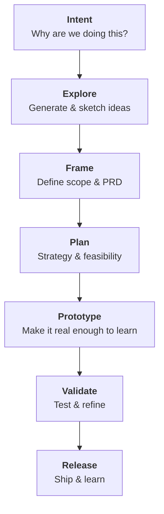

## WIP

The double diamond isn't working anymore. Code is too easy to generate for designers to wait to prototype anymore. After clarifying the "why", the new phase is exploration.

In the next few years, designers will become builders. Your skill in wielding the wave of AI tools is all that separates you from getting your ideas working in code exactly how you want.

Every part of an agent-built experience can be tailored with structured context.

Our job now is to understand what context an LLM needs and provide it step by step. We need to build the tooling that aligns LLM's to our pipeline and redirects and corrects it at every step.

Let's lay out the AI Design Pipeline:

### Intent

Why are we doing this?

- problem/opportunity
- constraints
- desired outcome
- success signals

### Explore

What could this be?

- idea generation
- sketches + low-fi
- rough concepts
- early assumptions
- breadth over depth

### Frame

What should we build? (PRD)

- Research
- Synthesis & insights
- clearly defined concept
- scope decisions
- decision gate: move forward or pivot

### Plan

How will we build and validate it?

- UX Strategy
- System thinking
- IA/UX Flows
- Technical feasibility
- Success metric plan

### Prototype

Make it real enough to learn from

- Prototype
- Iterate and refine
- Increased fidelity
- Realistic conetnt and interactions

### Validate

Does it actually work / solve customer problem?

- Testable UX (in dev/stage/prototype)
- run usability tests
- refinment based on feedback
- decision gate: ready to ship or loop back

### Release

Put it out into the world

- Ship, monitor metrics
- Post-launch feedback loops
- Add iterations to backlog

---

### plan.md ➡ prototype

Every idea should be able to be squashed into a portable `plan.md` file. This plan should be cross-examined with appropriate `AGENTS.md` context to build in the right way.

That means if you can get a `plan.md` file put together out of the `IDEA` phase, then you're on your way to immediate prototyping, assuming the only thing needed to implement a prototype with a capable set of Agent instructions is a detailed plan.
