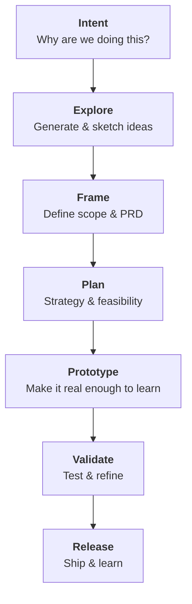

The double diamond used to be necessary. Code was expensive, and design had to be sure that what it communicated was exact. As perfect as it could be for an expensive handoff.

In many ways, that world doesn't exist anymore. Code is too easy to generate for designers to wait to prototype real working applications. Prompting and testing ideas fast is almost free now.

After clarifying the intent, and the "why" behind an idea, the next phase is exploration. Why wait to start feeling out the experience when it's a few prompts and a few minutes away from existing?

In the coming decades, designers will just be builders. Wielding AI tools is all that separates you from getting your ideas working in code exactly how you want.

It's tedious and laborious, but from a managerially side, instead of a design-practice based one. We've learned frameworks for interacting with our coworkers, communicating feedback and critique, and expressing minutiae in a way that makes sense.

This is all that Agents need in order to do their job. In other words, every part of an agent-built experience can be tailored with structured context.

Our job now is to understand what context an LLM needs and provide it step by step. We need to build the tooling and processes that aligns LLM's to our new design pipeline so that it redirects and corrects itself at every step.

Let's lay out the AI Design Pipeline:

### Intent

Why are we doing this?

- problem/opportunity
- constraints
- desired outcome
- success signals

### Explore

What could this be?

- idea generation
- sketches + low-fi
- rough concepts
- early assumptions
- breadth over depth

### Frame

What should we build? (PRD)

- Research
- Synthesis & insights
- clearly defined concept
- scope decisions
- decision gate: move forward or pivot

### Plan

How will we build and validate it?

- UX Strategy
- System thinking
- IA/UX Flows
- Technical feasibility
- Success metric plan

### Prototype

Make it real enough to learn from

- Prototype
- Iterate and refine
- Increased fidelity
- Realistic conetnt and interactions

### Validate

Does it actually work / solve customer problem?

- Testable UX (in dev/stage/prototype)
- run usability tests
- refinment based on feedback
- decision gate: ready to ship or loop back

### Release

Put it out into the world

- Ship, monitor metrics
- Post-launch feedback loops
- Add iterations to backlog
